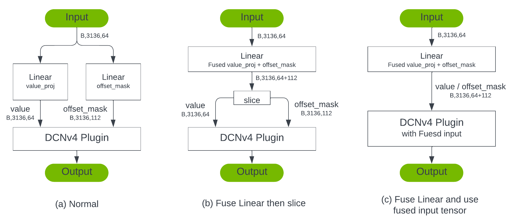

# DCNv4 Deployment On NVIDIA Drive Orin Platform
[Deformable Convolution v4 (DCNv4)](https://github.com/OpenGVLab/DCNv4) is a highly efficient operator for a wide range of vision tasks. It introduces dynamic property to convolution operator by gathering features based on learnable offsets. Compared with attention based method, DCNv4 maintains global context with less compute complexity.

We provide three TensorRT plugin implementations for DCNv4 on NVIDIA Drive Orin Platform in `plugins/`.
- `plugins/dcnv4Plugin` contains the DCNv4 plugin based on original implementation **Figure 1 (a)**. TensorRT will will perform graph optimization (e.g., layer fusion) for better latency performance as **Figure 1 (b)** shows.
- `plugins/dcnv4PtxPlugin` contains a tuned PTX kernel. It will takeover the original kernel calls in `dcnv4Plugin` if inputs satisfy certain shape and datatype constrains. **Figure 1 (c)**
- `plugins/dcnv4FusePlugin` contains a modified DCNv4 plugin to handle un-sliced input from fused linear layer. **Figure 1 (d)**

 
<div align="center"> Figure 1, how to optimize DCNv4 on NVIDIA Drive Orin Platform </div>

### Contents:
- [Benchmark](./README.md#benchmark)
- [Export DCNv4 Model from PyTorch to Onnx](./README.md#export-dcnv4-model-from-pytorch-to-onnx)
- [Optimized TensorRT Plugins](./README.md#optimized-tensorrt-plugins)
- [Compile and Run on NVIDIA Drive Orin Platform](./README.md#compile-and-run-on-nvidia-drive-orin-platform)
- [Reference](./README.md#reference)

## Benchmark
We choose `FlashInternImage-T` as our baseline model from pytorch. Here are benchmark results from official repo. Here is some facts about this configuration.
- Pretrain: ImagenNet-1K
- Resolution: 224x224
- #params: 30M
- [ckpt from official repo](https://huggingface.co/OpenGVLab/DCNv4/resolve/main/flash_intern_image_t_1k_224.pth)
- [cfg from official repo](https://github.com/OpenGVLab/DCNv4/classification/configs/flash_intern_image_t_1k_224.yaml)

### Benchmark FlashInternImage-T Inference on NVIDIA Drive Orin Platform
Environment for the benchmark:
- CUDA 11.4
- PyTorch: 1.14.0-aarch64
- TensorRT: 8.6.15.17

| Framework | Precision | Resolution | acc@1   | Runtime(ms/frame)  | Notes   |
| :-------: | :-------: | :--------: | :---:   | :-----:            | :-----: |
|  PyTorch  |    Fp32   |   224x224  |  83.6%  | 40.3152            | |
|  TensorRT |    Fp32   |   224x224  |  83.6%  | 6.64844            | |
|  TensorRT |    Fp16   |   224x224  |  83.3%  | 2.48438 | original implementation, Figure 1, (b)        |
|  TensorRT |    Fp16   |   224x224  |  83.3%  | 2.35394 | using optimized ptx kernels, Figure 1, (c)    |
|  TensorRT |    Fp16   |   224x224  |  83.3%  | 2.38281 | using un-sliced input directly, Figure 1, (d) |

## Export DCNv4 Model from PyTorch to Onnx
### Environment Setup
First clone the official DCNv4 repo and download the weights.
```bash
# Clone official DCNv4 repo
git clone https://github.com/OpenGVLab/DCNv4.git
cd DCNv4/classification

# Download the weights for flash_intern_image_t_1k_224 and put it at DCNv4/classicication/work_dirs
wget https://huggingface.co/OpenGVLab/DCNv4/resolve/main/flash_intern_image_t_1k_224.pth -O work_dirs/flash_intern_image_t_1k_224.pth
```

Then follow official instructions at [DCNv4/classification/README.md](https://github.com/OpenGVLab/DCNv4/blob/main/classification/README.md) to setup the environment.
```bash
# Setup virtual environment
conda create -n internimage python=3.7 -y
conda activate internimage
# Install pytorch, torchvision with cuda 11.3, you may change this according to your environment
pip install torch==1.11.0+cu113 torchvision==0.12.0+cu113 -f https://download.pytorch.org/whl/torch_stable.html
```
You can also use [PyTorch NGC Container](https://catalog.ngc.nvidia.com/orgs/nvidia/containers/pytorch) provided by NVIDIA. It contains cuda and pytorch related packages with proper version.
```bash
# please change imagenet and repo dirs accordingly
docker run --name=export_dcnv4 -d -it --rm --shm-size=4096m --privileged --gpus all --network=host -v /dir_to_imagenet:/imagenet -v /dir_to_dcnv4_repo:/DCNv4 nvcr.io/nvidia/pytorch:24.04-py3 /bin/bash
```

Then install other dependencies.
```bash
# Install dependencies
pip install -U openmim
mim install mmcv-full==1.5.0
pip install timm==0.6.11 mmdet==2.28.1
pip install opencv-python termcolor yacs pyyaml scipy
pip install onnx onnxruntime onnxsim
pip install DCNv4==latest
```

### Export the model
Copy `DCNv4_trt/tools/export_onnx.py` to `DCNv4/classification/` and run the following command lines. Please note that in function `dcnv4_function_handler`, keywords should be setup according to your plugin's implementation.
```bash
cd DCNv4/classification/
python export_onnx.py --model_name=flash_intern_image_t_1k_224 --ckpt_dir=work_dirs/ --onnx
# then use onnxsim to simplify the onnx
onnxsim flash_intern_image_t_1k_224.onnx sim_flash_intern_image_t_1k_224.onnx
```
Now you should have `sim_flash_intern_image_t_1k_224.onnx`. It will be used to create a TensorRT engine file with `trtexec` in next section.

### Optimized TensorRT Plugins
#### Fusing inputs for less memory traffic
We speed up the inference by fusing parallel linear layers. Here we use input image size [B,3,224,224] as example. In Stage0, DCNv4 block 0, there are two `torch.nn.Linear` layers, `value_proj` and `offset_proj`. `value_proj` takes a `[B,3136,64]` input feature and projects it into a `[B,3136,64]` value feature. And `offset_proj` also takes the `[B,3136,64]` input feature and produces the `[B,3136,112]` offset values accordingly.

Since they are running in parallel sharing the `N` dimension and consume the same input tensor, we can fuse them as one single Linear layer for better performance. After the layer fusion, we can save the kernel launch overhead and eliminate the redundant memory traffic. In original implementation, DCNv4 operator requires values and offset as separate input tensors. So we need a extra slice operator to slice the fused tensor. The slice operator introduce [B,3136,(64+112)] memory read and write.

To eliminate above memory traffic, we adjusted the internal logic inside DCNv4 plugin and use the un-sliced tensor directly. This makes the plugin able to consume the output from the fused linear layer. You can try the following commands to fuse the ops inside original onnx file.
```bash
# fuse value_proj and offset_proj in onnx file
python tools/fuse_value_and_offset.py onnxfiles/sim_flash_intern_image_t_1k_224.onnx
# save as onnxfiles/sim_flash_intern_image_t_1k_224_fused.onnx
```

#### PTX level kernel tuning
We also tuned the kernel at PTX level for faster speed. Compared to the official CUDA implementation of DCNv4,
this implementation maximizes vectorization for memory traffic,
using 128-bit vector loads and stores in all except a few cases of data movement.
Other notable features include the use of shared memory for the `offset` (second) input,
and partial unrolling of the reduction dimension loop. The PTX code will be load and compiled when build engine, and then serialized into the buffer. When we deserialize the engine, we can directly load and launch the compiled kernel. This can help eliminate the compilation overhead when we do inference.

Here we use the first DCNv4 op in block0 as an example. We observe significantly performance improvement after carefully tuning.  
> **NOTE:** Current PTX implementation only tuned for the follwoing input size combinations (128x3136x64, 1x3136x64, 1x784x128, 1x196x256, 1x49x512).

| Kernel                     | Precision | value size     | offset size    | Runtime(ms/batch) |
| :-------:                  | :-------: | :--------:     | :---:          | :-----:           |
|  Hand-written cuda kernel  |    Fp16   |   128x3136x64  |  128x3136x112  | 5.61914           |
|  PTX kernel                |    Fp16   |   128x3136x64  |  128x3136x112  | 4.60938           |

## Compile and Run on NVIDIA Drive Orin Platform
### Hardware
NVIDIA Drive Orin Platform
- Nvidia Drive OS 6.0.9.0
- CUDA 11.4 + TensorRT 8.6

### Cross-compile on host machine
We recommend using NVIDIA Drive OS Linux docker image: `nvcr.io/<your team>/driveos-pdk/drive-agx-orin-linux-aarch64-pdk-build-x86:6.0.9.0-0007` as the cross-compile environment.
To launch the docker on the host x86 machine, you may run:
```shell
docker run --gpus all -it --network=host --rm \
    -v DCNv4_trt_REPO_DIR:/DCNv4_trt \
    nvcr.io/<your team>/driveos-pdk/drive-agx-orin-linux-aarch64-pdk-build-x86:6.0.9.0-0007
```

Inside the docker, cd to `/DCNv4_trt` and execute the following commands to cross-compile on x86.
```bash
cd /DCNv4_trt
bash build.sh orin -DUSE_PTX=1
# set TRT_ROOT if you want to use different tensorrt
TRT_ROOT=/folder/to/your/tensorrt_lib bash build.sh orin -DUSE_PTX=1 
```
If you encountered with `No CMAKE_CUDA_COMPILER could be found.`, please run the command line below to help cmake locate `nvcc`
```bash
export PATH=$PATH:/usr/local/cuda/bin
```

This will create a `build/orin` folder, and the cross-compiled executable `DCNv4_app` as well as the plugin library `libDCNv4_plugin.so` will be there. You can then copy these files to NVIDIA Drive Orin Platform and do the inference.
Once cross compiled the plugin and the app, you can copy `./build/orin/DCNv4_app`, `build/orin/plugins/libDCNv4_plugin.so` and `./onnxfiles/sim_flash_intern_image_t_1k_224_fused.onnx` to the board. The file structure should look like:
```
assets/
  - cute.jpg
onnxfiles/
  - sim_flash_intern_image_t_1k_224_fused.onnx
engines/
libDCNv4_plugin.so
DCNv4_app
```

### Build TensorRT engine
To build a TensorRT engine, you can run the following command lines with trtexec.
> NOTE: We provide these onnx files with random weights to profile the inference performance.

```bash
# copy the exported onnx file to NVIDIA Drive Orin Platform and put it in onnxfiles/.
# build the engine
trtexec --onnx=./onnxfiles/sim_flash_intern_image_t_1k_224_fused.onnx \
        --fp16 \
        --staticPlugins=libDCNv4_plugin.so
        --skipInference \
        --saveEngine=./engines/flash_intern_image_t_1k_224_fused_fp16.engine
```
You may also try with unfused onnxfile and compare the performance difference.
```bash
trtexec --onnx=./onnxfiles/sim_flash_intern_image_t_1k_224.onnx \
        --fp16 \
        --staticPlugins=libDCNv4_plugin.so
        --skipInference \
        --saveEngine=./engines/flash_intern_image_t_1k_224_fp16.engine
```

### Single image classification
You may pass a path of a jpeg image to our image classification application `DCNv4_app`. It will load the jpeg file, preprocess it, do inference and report the classification result of this image.
```bash
./DCNv4_app ./libDCNv4_plugin.so ./engines/flash_intern_image_t_1k_224_fused_fp16.engine ./assets/cute.jpg
nvinfer: 8.6.12
[1] input, [1, 3, 224, 224], type = 0
[2] output, [1, 1000], type = 0
./assets/cute.jpg: 282 # class_idx 282 is 'tiger cat'
```

## Reference
- Official repo: [DCNv4](https://github.com/OpenGVLab/DCNv4)
- Paper: [Efficient Deformable ConvNets: Rethinking Dynamic and Sparse Operator for Vision Applications](https://arxiv.org/pdf/2401.06197.pdf)
- NVIDIA TensorRT getting started: [Link](https://developer.nvidia.com/tensorrt-getting-started)
- NVIDIA TensorRT Github repo: [Link](https://github.com/NVIDIA/TensorRT)
- NVIDIA Parallel Thread Execution ISA: [Link](https://docs.nvidia.com/cuda/parallel-thread-execution/)
- NVRTC Library: [Link](https://docs.nvidia.com/cuda/nvrtc/index.html)
