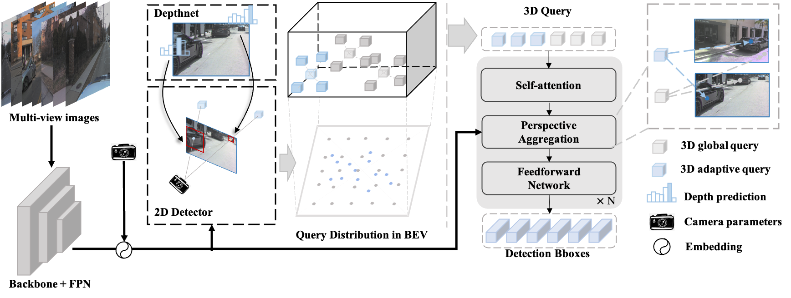
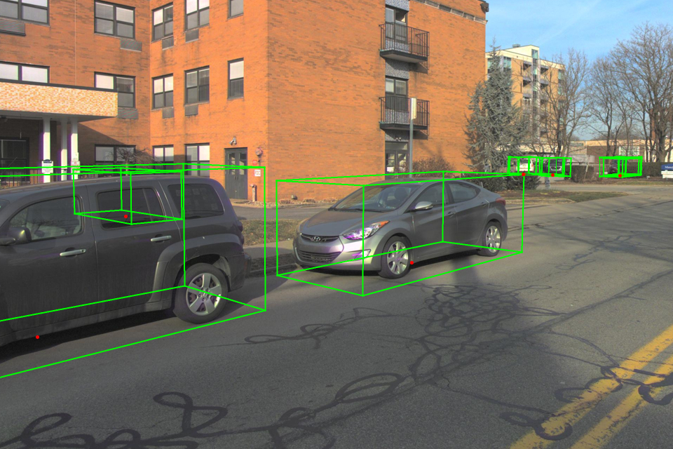

# Introduction
[Far3D](https://github.com/megvii-research/Far3D) is the state of the art for camera only 3D object detection on the NuScenes dataset. It achieves this by using a 2D detector to initialize 3D adaptive queries which are then cross attended across camera views using perspective aware feature aggregation.  This repository implements the changes and tools necessary to deploy a Far3D model using TensorRT on NVIDIA DRIVE Orin.



(Image taken from the [Far3D repo](https://github.com/megvii-research/Far3D))

## News
- `[2025-03-19]` Added support for a mixed precision decoder in TensorRT 10+ which reduces latency by more than 40% with marginal accuracy loss.

# Prerequisites
Repository preparation
Please execute the following commands to download this repository and apply patches.

```shell
  git clone http://github.com/NVIDIA/DL4AGX
  cd DL4AGX
  git submodule update --init --recursive
  cd AV-Solutions/far3d-trt/dependencies/Far3D
  git apply ../../patch/far3d.patch
```
In all future instructions, AV-Solutions/far3d-trt will be considered the root of the workspace.

# Pytorch model to ONNX
Build the docker environment to be used for exporting the model
```shell
  cd docker && docker build . -t far3d --network=host
```

Copy your Far3D config and weights into the workspace.  Please also download the [pretrained weights](https://github.com/megvii-research/Far3D/releases/download/v1.0/iter_82548.pth) and put them in the weights folder.

Before proceeding, please download and extract the [argoverse2 validation dataset](https://www.argoverse.org/av2.html#download-link), preprocessing of the data will be done inside of the container with the installed dependencies.

### Run the docker container
Run the docker container with GPU access, and the argoverse2 dataset mount location:
```shell
  docker run -it --network=host --gpus=all --shm-size=80G --privileged \
    -v /data/av2:/data/av2 \
    -v $(pwd)/../:/workspace far3d
```
The above container will be referred to as the `export container`.

# Data preparation for validation
The folder structure inside of the `export container` should be as follows with the mounted argoverse dataset prior to preprocessing:

```
📦 /workspace/far3d-trt
 ┗ data
   ┣ 📂av2
   ┃ ┣ 📂val
   ┃ ┃ ┣ 📂scene0
   ┃ ┃ ┣ 📂scene ...
   ┃ ┃ ┗ 📂sceneN
   ┣ 📜decoder_input.pkl
   ┣ 📜encoder_input.pkl
   ┗ 📜model_input.pkl
```

Now preprocess the dataset to generate metadata files from av2 annotations with the following commands inside the `export container`:
```shell
  python3 dependencies/Far3D/tools/create_infos_av2/create_av2_infos.py
  python3 dependencies/Far3D/tools/create_infos_av2/gather_argo2_anno_feather.py
```

After the above steps, the file structure should be as follows:
```
📦 /workspace/far3d-trt
 ┗ data
   ┣ 📂av2
   ┃ ┣ 📂val
   ┃ ┃ ┣ 📂scene0
   ┃ ┃ ┣ 📂scene ...
   ┃ ┃ ┗ 📂sceneN
   ┃ ┣ 📜av2_val_infos.pkl
   ┃ ┗ 📜val_anno.feather
   ┣ 📜decoder_input.pkl
   ┣ 📜encoder_input.pkl
   ┗ 📜model_input.pkl
```


### Export the model
Use the following command to export the model to onnx, modifying the config and weights parameters accordingly.
```shell
  export PYTHONPATH=$(pwd)/dependencies/Far3D/
  python3 tools/export_onnx.py dependencies/Far3D/projects/configs/far3d.py weights/iter_82548.pth
```
The above workflow will produce a "far3d.encoder.onnx" and a "far3d.decoder.onnx" file in the root of the workspace.

### Post Training Quantization
To further reduce latency, we demonstrate how to perform post training quantization on the image encoder to enable INT8 inference. Use the following command to quantize the encoder, modifying the config and onnx path parameters accordingly.  The below command will sample 500 batches at an interval of one sample per 20 batches from the validation set for calibration.
```shell
    export PYTHONPATH=$(pwd)/dependencies/Far3D/
    python3 tools/quantize_onnx.py dependencies/Far3D/projects/configs/far3d.py far3d.encoder.onnx --num_samples=500 --sample_skip_interval=20
```
The above command will produce a post training quantized 'far3d.encoder.int8.onnx' along with quantization data 'far3d.encoder.int8.onnx.data' and 'far3d.encoder.int8.onnx_data' for TensorRT to consume.  

# Building TensorRT engine on DRIVE Orin
This model has been tested on NVIDIA DRIVE Orin with TensorRT 8.6 and TensorRT 10.9. To get access to these versions of TensorRT, please refer to details on the [NVIDIA DRIVE site](https://developer.nvidia.com/drive/downloads). These versions of TensorRT comes with a compatible version of MultiScaleDeformableAttention (MSDA) inside the default libnvinfer_plugins.so library which enables the Far3D transformer decoder.

Far3D TensorRT engine files can be generated with trtexec on the target device:
```shell
  trtexec --onnx=far3d.encoder.onnx --saveEngine=far3d.encoder.fp16.engine --fp16
  # stronglyTyped is a feature of TensorRT 10+ thus for the encoder this could be swapped for "--fp16" on TensorRT 8.6 without loss of accuracy.
  trtexec --onnx=far3d.encoder.int8.onnx --saveEngine=far3d.encoder.int8.engine --stronglyTyped
  # The stongly typed onnx file is still compatible with TensorRT 8.6 as a weakly typed fp32 model with no loss in accuracy.
  trtexec --onnx=far3d.decoder.onnx --saveEngine=far3d.decoder.fp32.engine
  # stronglyTyped is a feature of TensorRT 10+ and thus the following will not work for 8.6
  trtexec --onnx=far3d.decoder.onnx --saveEngine=far3d.decoder.fp16.engine --stronglyTyped
  
```
The strategy used here to enable FP16 in the decoder is to keep all operations on features in FP16 and to keep all operations on points and intrinsics in FP32. The reason for this is that the intrinsic matrices are sensitive to casting to FP16, and that the matrix multiplications involved with point projection are prone to overflowing FP16 precision. Both of these operations are on small amounts of data while the operations on features are much less error prone to lower precision. The strongly typed network feature that was introduced in TensorRT 10+ enables precise precision control of operations and tensors which we use to achieve a significant reduction in latency while maintaining the necessary precision for sensitive operations and tensors.

# Verifying TensorRT model performance
The following command can be used to verify TensorRT model performance on the complete argoverse validation set using TensorRT python bindings.  This needs to be done from inside the `export container` due to a dependency on MMCV for dataloading and preprocessing.
```shell
  python3 tools/test_tensorrt.py dependencies/Far3D/projects/configs/far3d.py far3d.encoder.fp16.engine far3d.decoder.fp16.engine
```

# Inference application in C++

### Extract sample data

The example C++ inference application expects binary dumps on disk, this data can be extracted with the following command executed from the `export container`:

```shell
  python3 tools/extract_data.py dependencies/Far3D/projects/configs/far3d.py
```

The above command needs the Far3D configuration file to ensure data is loaded consistently with how it was exported to ensure a correct performance evaluation. It will produce a dump of data for the first scene in argoverse2 into the data folder as well as data/filelist.txt which instructs the c++ inference application which frames to run inference on.

### Cross compile C++ inference application on x86 for NVIDIA DRIVE Orin

We recommend using the following NVIDIA DRIVE docker image `drive-agx-orin-linux-aarch64-sdk-build-x86:6.0.10.0-0009` as the cross-compile environment, this container will be referred to as the `build container`.
To launch the docker on the host x86 machine, you may run:
```shell
docker run --gpus all -it --network=host --rm \
    -v $(pwd)/../:/workspace \
    nvcr.io/drive/driveos-sdk/drive-agx-orin-linux-aarch64-sdk-build-x86:latest
```
To gain access to this image please join the [DRIVE AGX SDK Developer Program](https://developer.nvidia.com/drive/agx-sdk-program).

#### Build instructions
The C++ inference application has a dependency on Eigen3 which can be installed from apt with the following:
```shell
apt-get install libeigen3-dev
```

The C++ inference application follows standard cmake practices, it can be built as follows:
```shell
  mkdir build
  cd build
  cmake ../inference_app -DTENSORRT_ROOT=/data/TensorRT -DTARGET=orin
  make -j
```

#### Run C++ inference application
The above will generate a libfar3d.so shared library and a main inference application. It is recommended to network mount this workspace to your NVIDIA DRIVE Orin to enable data sharing. The main inference application can be run as follows from the Orin device, selecting from FP16 or FP32 for decoder precision:
```shell
  ./build/main far3d.encoder.fp16.engine far3d.decoder.{decoder_precision}.engine data/filelist.txt
```

It will produce ${prefix}_bboxes.bin, ${prefix}_labels.bin, and ${prefix}_scores.bin which can be loaded by numpy in the following step for validation; as well as several visualizations of detections such as the following:


#### Validate inference results
The first sequence of argoverse can be tested with the following command from the `export container`:
```shell
  python3 tools/evaluate_inference_app_output.py dependencies/Far3D/projects/configs/far3d.py
```

The above command expects your config file as an input to configure dataloading, it then will read the first sequence of data and evaluate model performance on it by loading the binary blobs generated in the last step.

# Results on Argoverse2 validation set
These results are based on the pretrained [reference model](https://github.com/megvii-research/Far3D/releases/download/v1.0/iter_82548.pth) ([config](https://github.com/megvii-research/Far3D/blob/main/projects/configs/far3d.py)) with a VoV-99 backbone at 960x640 input resolution. Latency measurements were collected on a DRIVE Orin-X platform.

|         Precision          | Framework          | GPU Compute Time (median, ms)| Accuracy (mAP) |
|----------------------------|--------------------|------------------------------|----------------|
|FP32 encoder + FP32 decoder |  Pytorch   1.13.1  |          730.0               |     0.241      |
|FP32 encoder + FP32 decoder |  TensorRT  8.6     |          538.5               |     0.233      |
|FP16 encoder + FP32 decoder |  TensorRT  8.6     |          367.4               |     0.233      |
|FP16 encoder + FP16 decoder |  TensorRT  10.9    |          203.9               |     0.232      |
|INT8 encoder + FP16 decoder |  TensorRT  10.9    |          132.3               |     0.230      |
