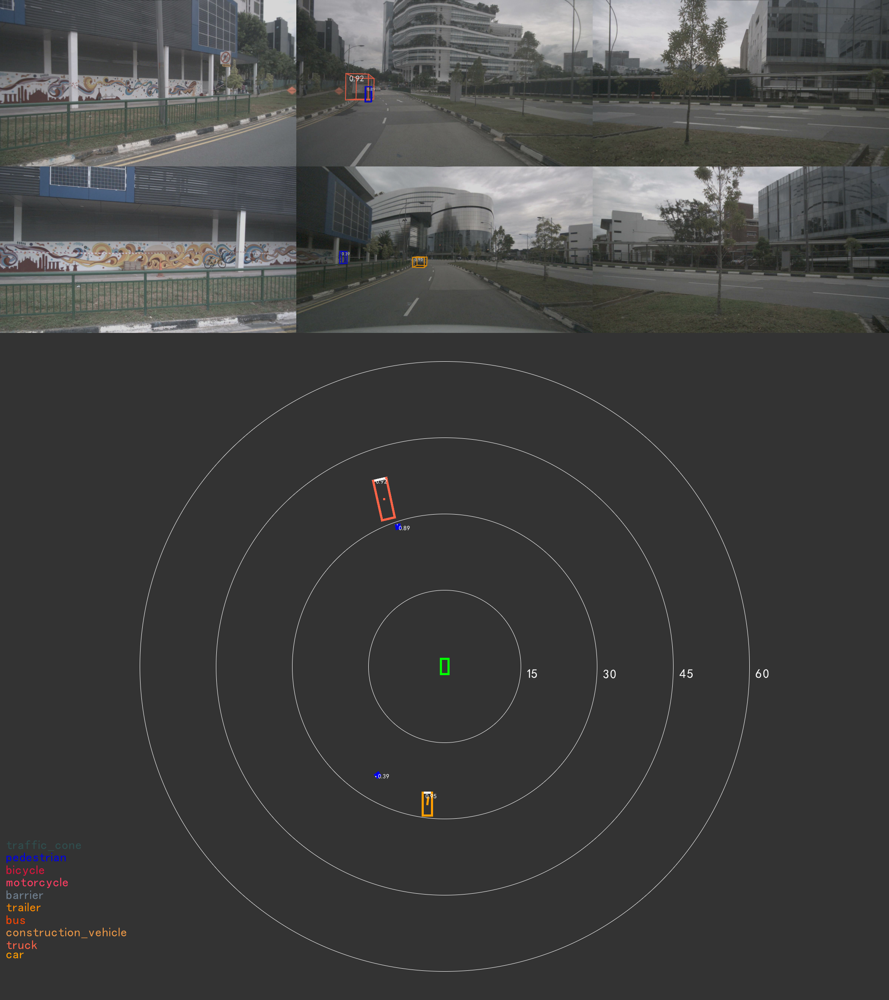
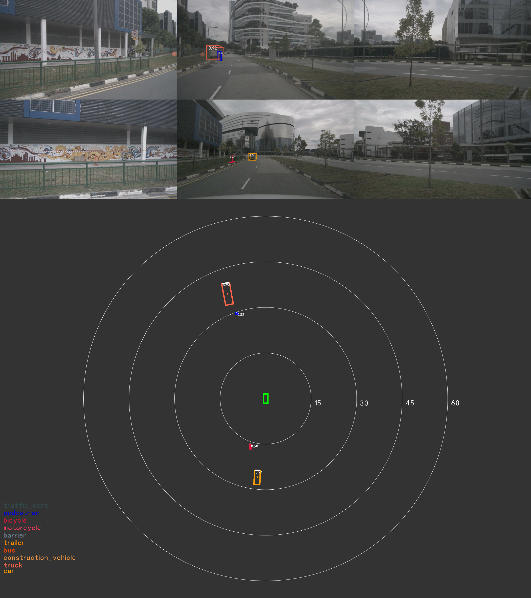

# PETR-TensorRT
[PETRv1, PETRv2](https://github.com/megvii-research/PETR) is designed for multi-view 3D object detection task. 
PETR stands for "position embedding transformation" and encodes the position information into image features thus able to produce position-aware features.
For more detail, please refer to:
- PETRv1: [ECCV2022] PETR: Position Embedding Transformation for Multi-View 3D Object Detection [arxiv](https://arxiv.org/abs/2203.05625)
- PETRv2: [ICCV2023] PETRv2: A Unified Framework for 3D Perception from Multi-Camera Images [arxiv](https://arxiv.org/abs/2206.01256)

In this demo, we will use [PETR-vov-p4-800x320](https://github.com/megvii-research/PETR/blob/main/projects/configs/petr/petr_vovnet_gridmask_p4_800x320.py) for PETRv1 
and [PETRv2-vov-p4-800x320](https://github.com/megvii-research/PETR/blob/main/projects/configs/petrv2/petrv2_vovnet_gridmask_p4_800x320.py) for PETRv2 as our deployment targets.

| Method                | Backbone<br>precision | Head<br>precision | Framework | mAP | Latency(ms) |
| :---:                 | :---:  | :---:     | :-------: | :---:    | :------------:  |
| PETR-vov-p4-800x320   | fp16   | fp32      | PyTorch   | 0.3778   |      -          |
| PETR-vov-p4-800x320   | fp16   | fp16      | TensorRT  | 0.3774   | 52.37 (On Orin) |
| PETRv2-vov-p4-800x320 | fp16   | fp32      | PyTorch   | 0.4106   |      -          |
| PETRv2-vov-p4-800x320 | fp16   | fp16      | TensorRT  | 0.4101   | 55.77 (On Orin) |

## Environment setup

```bash
cd /workspace
git clone https://github.com/NVIDIA/DL4AGX.git
cd DL4AGX
git submodule update --init --recursive

cd /workspace
git clone https://github.com/megvii-research/PETR
cd PETR
git apply /workspace/DL4AGX/AV-Solutions/petr-trt/patch.diff
git clone https://github.com/open-mmlab/mmdetection3d.git -b v0.17.1
```

Please follow the instructions in the official repo ([install.md](https://github.com/megvii-research/PETR/blob/main/install.md), [prepare-dataset.md](https://github.com/open-mmlab/mmdetection3d/blob/master/docs/en/data_preparation.md)) to setup the environment for PyTorch inference first. Since there are some api changes in newer mmcv/mmdet, we adjust the original configs. You may find those minor changes in [patch.diff](./patch.diff).
Then download `PETR-vov-p4-800x320_epoch24.pth` from https://drive.google.com/file/d/1-afU8MhAf92dneOIbhoVxl_b72IAWOEJ/view?usp=sharing
and `PETRv2-vov-p4-800x320_epoch24.pth` from https://drive.google.com/file/d/1tv_D8Ahp9tz5n4pFp4a64k-IrUZPu5Im/view?usp=sharing
to folder `/workspace/PETR/ckpts`. Note: these two files originally have the same name `epoch_24.pth` so don't forget to rename after download them.

After the setup, your PETR folder should looks like:
```
├── data/
│   └── nuscenes/
│       ├── v1.0-trainval/
│       ├── samples/
│       ├── sweeps/
│       ├── nuscenes_infos_train.pkl
│       ├── nuscenes_infos_val.pkl
│       ├── mmdet3d_nuscenes_30f_infos_train.pkl
│       └── mmdet3d_nuscenes_30f_infos_val.pkl
├── mmdetection3d/
├── projects/
├── tools/
├── install.md
├── requirements.txt
├── LICENSE
└── README.md
```

You may verify your installation with
```bash
cd /workspace/PETR
CUDA_VISIBLE_DEVICES=0 python tools/test.py /workspace/PETR/projects/configs/petr/petr_vovnet_gridmask_p4_800x320.py /workspace/PETR/ckpts/PETR-vov-p4-800x320_e24.pth --eval bbox
```
This command line is expected to output the benchmark results. This environment for PyTorch inference and benchmark will be referred to as `torch container`.

> **NOTE**
> 1. For the best user experience, we highly recommend use **torch >= 1.14**. You may also build the docker with given [./dockerfile](./dockerfile). To build the docker, here is the example command line. You may change the argument for volume mapping according to your setup.
> ```bash
> cd /workspace/DL4AGX/AV-Solutions/petr-trt
> docker build --network=host -f dockerfile . -t petr-trt
> docker run --name=petr-trt -d -it --rm --shm-size=4096m --privileged --gpus all -it --network=host \
>    -v /workspace:/workspace -v <path to nuscenes>:/data \
>    petr-trt /bin/bash
> ```

## Export to ONNX on x86
To setup the deployment environment, you may run the following commands. Please note that we will export the onnx inside petr-trt.
```bash
cd /workspace/DL4AGX/AV-Solutions/petr-trt/export_eval
ln -s /workspace/PETR/data data # create a soft-link to the data folder
ln -s /workspace/PETR/mmdetection3d mmdetection3d # create a soft-link to the mmdetection3d folder
export PYTHONPATH=.:/workspace/PETR/:/workspace/DL4AGX/AV-Solutions/petr-trt/export_eval/
```

### Export PETRv1
To export the ONNX of `PETRv1`
```bash
cd /workspace/DL4AGX/AV-Solutions/petr-trt/export_eval
python v1/v1_export_to_onnx.py /workspace/PETR/projects/configs/petr/petr_vovnet_gridmask_p4_800x320.py /workspace/PETR/ckpts/PETR-vov-p4-800x320_e24.pth --eval bbox
```
This script will create `PETRv1.extract_feat.onnx` and `PETRv1.pts_bbox_head.forward.onnx` inside `onnx_files`.

### Export PETRv2
As `PETRv2` is a temporal model, the inference behavior is slightly different from `PETRv1`. 
Originally the backbone extract features from two input frames, i.e. the current and the previous frames.
However the feature extracted from the previous frame can be reused to improve efficiency.
So, we modify the behavior of function `extract_feat` when we export the model. 
It will use cached feature map as input instead of recomputing them.

```bash
cd /workspace/DL4AGX/AV-Solutions/petr-trt/export_eval
python v2/v2_export_to_onnx.py /workspace/PETR/projects/configs/petrv2/petrv2_vovnet_gridmask_p4_800x320.py /workspace/PETR/ckpts/PETRv2-vov-p4-800x320_e24.pth --eval bbox
```
This script will create `PETRv2.extract_feat.onnx` and `PETRv2.pts_bbox_head.forward.onnx` inside `onnx_files`.

> **NOTE**
> As `coords_position_embeding` solely depends on `lidar2img` and `img_shape` from `img_metas`, we move this part outside of the onnx.
> We can use the same `coords_position_embeding` tensor if `lidar2img` and `img_shape` remains unchange.

## Benchmark and Evaluation with TensorRT on x86
We provide `v1/v1_evaluate_trt.py` and `v2/v2_evaluate_trt.py` to run benchmark with TensorRT. It will produce similar result as the original benchmark with PyTorch.

1. Prepare dependencies for benchmark:
```bash
pip install <TensorRT Root>/python/tensorrt-<version>-cp38-none-linux_aarch64.whl
```

2. Build TensorRT engine

We provide a script that will load and create engine files for the four simplified onnx files.
```bash
export TRT_ROOT=<path to your tensorrt dir>
export LD_LIBRARY_PATH=$LD_LIBRARY_PATH:$TRT_ROOT/lib

cd /workspace/DL4AGX/AV-Solutions/petr-trt/export_eval
bash onnx2trt.sh
```
The above script builds TensorRT engines in FP16 precision as an example.

3. Run benchmark with TensorRT
```bash
export LD_LIBRARY_PATH=$LD_LIBRARY_PATH:$TRT_ROOT/lib
cd /workspace/DL4AGX/AV-Solutions/petr-trt/export_eval
# benchmark PETRv1
python v1/v1_evaluate_trt.py /workspace/PETR/projects/configs/petr/petr_vovnet_gridmask_p4_800x320.py /workspace/PETR/ckpts/PETR-vov-p4-800x320_e24.pth --eval bbox
# benchmark PETRv2
python v2/v2_evaluate_trt.py /workspace/PETR/projects/configs/petrv2/petrv2_vovnet_gridmask_p4_800x320.py /workspace/PETR/ckpts/PETRv2-vov-p4-800x320_e24.pth --eval bbox
```
As we replace the backend from PyTorch to TensorRT while keeping other parts like data loading and evaluation unchanged, you are expected to see outputs similar to the PyTorch benchmark.

## Deployment on NVIDIA DRIVE Orin
This model is to be deployed on NVIDIA DRIVE Orin with **TensorRT 10.8.0.32**. 
We will use the following NVIDIA DRIVE docker image `drive-agx-orin-linux-aarch64-pdk-build-x86:6.5.1.0-latest` as the cross-compile environment, this container will be referred to as the `build container`.

To launch the docker on the host x86 machine, you may run:
```shell
docker run --gpus all -it --network=host --rm \
    -v /workspace:/workspace \
    nvcr.io/drive/driveos-sdk/drive-agx-orin-linux-aarch64-pdk-build-x86:6.5.1.0-latest
```
To gain access to the docker image and the corresponding TensorRT, please join the [DRIVE AGX SDK Developer Program](https://developer.nvidia.com/drive/agx-sdk-program). You can find more details on [NVIDIA DRIVE](https://developer.nvidia.com/drive) site.

### Cross compile demo app on x86 for NVIDIA DRIVE Orin
Similar to what we did when building plugins, you may run the following commands inside the `build container`.
```bash
# inside cross-compile environment
cd /workspace/dl4agx/AV-Solutions/petr-trt/app
bash setup_dep.sh # download dependencies (stb, cuOSD)
mkdir -p build+orin && cd build+orin
cmake -DTARGET=aarch64 -DTRT_ROOT=<path to your aarch64 tensorrt dir> .. && make
```
We expect to see `petr_v1` and `petr_v2` under `petr-trt/app/build+orin/`

### Prepare for the demo run
In this demo run, we will setup everything under folder `petr-trt/app/demo/`.

1. Copy cross-compiled application to demo folder
```bash
cd /workspace/dl4agx/AV-Solutions/petr-trt/
cp app/build+orin/petr* app/demo/
```

2. Prepare input data for inference

In the `torch container` environment on x86, run
```bash
cd /workspace/dl4agx/AV-Solutions/petr-trt/export_eval
python v1/v1_save_data.py /workspace/PETR/projects/configs/petr/petr_vovnet_gridmask_p4_800x320.py /workspace/PETR/ckpts/PETR-vov-p4-800x320_e24.pth --eval bbox
python v2/v2_save_data.py /workspace/PETR/projects/configs/petrv2/petrv2_vovnet_gridmask_p4_800x320.py /workspace/PETR/ckpts/PETRv2-vov-p4-800x320_e24.pth --eval bbox
```
This will dump necessary data files to `petr-trt/export_eval/demo/data/`. Please beware that `v2_save_data.py` will only generate necessary data files on top of `v1_save_data.py`. Make sure you call `v1/v1_save_data.py` first then `v2/v2_save_data.py`.

We can then move them by
```bash
cd /workspace/DL4AGX/AV-Solutions/petr-trt/
cp -r export_eval/demo/data/ app/demo/
cp -r export_eval/onnx_files/*.onnx app/demo/onnx_files/
```

Now the `petr-trt/app/demo` folder should be organized as:
```
├── data/
│   ├── cams/
│   ├── imgs/
│   ├── lidar2imgs/
│   ├── v1_coords_pe.bin
│   ├── v2_coords_pe.bin
│   └── v2_mean_time_stamp.bin
├── engines/
├── onnx_files/
│   ├── PETRv1.extract_feat.onnx
│   ├── PETRv1.pts_bbox_head.forward.onnx
│   ├── PETRv2.extract_feat.onnx
│   └── PETRv2.pts_bbox_head.forward.onnx
├── viz_v1/
├── viz_v2/
├── onnx2trt.sh
├── simhei.ttf
├── v1_config.json
└── v2_config.json
```
Now you may copy or mount all the data under `DL4AGX/AV-Solutions/petr-trt/app/demo` to `/demo` folder on **NVIDIA Drive Orin**.

### Build engines with trtexec
You may utilize `trtexec` to build the engine from the onnx files on **NVIDIA Drive Orin**. We provide a bash script that wraps `trtexec` commands.

```bash
export TRT_ROOT=<path to tensorrt on NVIDIA Drive Orin>
cd /demo
bash onnx2trt.sh
```
This script will load all four onnx files under `/demo/onnx_files` and generate the corresponding engine files under `/demo/engines/`.
You may explore the [script](app/demo/onnx2trt.sh), and modify options like precision according to your needs.

### Run and visualize with the demo app
To run the demo app, just simply call
```bash
export LD_LIBRARY_PATH=$LD_LIBRARY_PATH:$TRT_ROOT/lib
cd /demo
# to run petr v1
./petr_v1 ./v1_config.json
# to run petr v2
./petr_v2 ./v2_config.json
```
Then you may find visualization result under `/demo/viz_v1` and `/demo/viz_v2` in jpg format.

Example (Left PETRv1, Right PETRv2):<br />



## License
- PETRv1&v2 and it's related code were licensed under [Apache-2.0](https://github.com/megvii-research/PETR/blob/main/LICENSE)
- cuOSD and it's related code were licensed under [MIT](https://github.com/NVIDIA-AI-IOT/Lidar_AI_Solution/blob/master/LICENSE.md)

## Reference <a name="ref"></a>
- [PETRv1&v2 official Repo](https://github.com/megvii-research/PETR)
- [NVIDIA TensorRT Github](https://github.com/NVIDIA/TensorRT)
- [NVIDIA Drive](https://developer.nvidia.com/drive)
- [stb](https://github.com/nothings/stb/tree/master)
- [mmdetection3d](https://github.com/open-mmlab/mmdetection3d)
- [CUDA-BEVFusion Repository](https://github.com/NVIDIA-AI-IOT/Lidar_AI_Solution/tree/master/CUDA-BEVFusion)
- [cuOSD Repository](https://github.com/NVIDIA-AI-IOT/Lidar_AI_Solution/tree/master/libraries/cuOSD)
