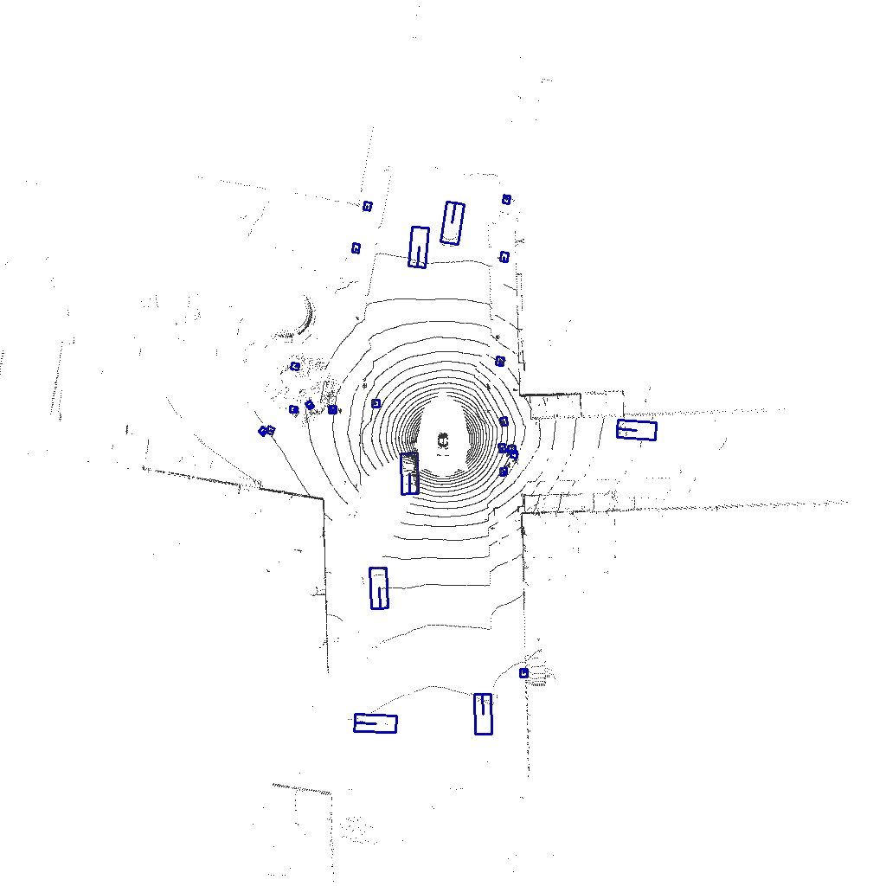

# StreamPETR Inference Application with TensorRT
This folder contains the code for running the StreamPETR C++ application with TensorRT on NVIDIA Drive Orin Platform or x86 Linux environment.

## Data Preparation
For each frame, we should prepare `img`, `cone`, `pos_embed`, `ego_pose` and `timestamp` as input. And `all_cls_scores`, `all_bbox_preds` as reference output for numerical verification between pytorch and TensorRT.
These torch tensors can be dumped by calling `torch_tensor.cpu().detach().numpy().tofile(name.bin)`. For example, at [github link](https://github.com/exiawsh/StreamPETR/blob/2315cf9f077817ec7089c87094ba8a63f76c2acf/projects/mmdet3d_plugin/models/detectors/petr3d.py#L315):
```python
class Petr3D(MVXTwoStageDetector):
    ...

    def simple_test(self, img_metas, **data):
        """Test function without augmentaiton."""
        data['img_feats'] = self.extract_img_feat(data['img'], 1)
        
        data['img'].cpu().detach().numpy().tofile("img.bin")  # adding this line to save data['img'] as binary file

        bbox_list = [dict() for i in range(len(img_metas))]
        bbox_pts = self.simple_test_pts(
            img_metas, **data)
        for result_dict, pts_bbox in zip(bbox_list, bbox_pts):
            result_dict['pts_bbox'] = pts_bbox
        return bbox_list
```

A full tensor list is as below. Column `Tensor Name` is the dumped data file name. Column `Tensor Variable` is the variable name that will be dumped. And column `location` is the link to the variable location.

| Tensor Name | Tensor Variable | Location |
| ------------|--------|----------|
| img.bin     | data['img'] | [projects/mmdet3d_plugin/models/detectors/petr3d.py#L315](https://github.com/exiawsh/StreamPETR/blob/2315cf9f077817ec7089c87094ba8a63f76c2acf/projects/mmdet3d_plugin/models/detectors/petr3d.py#L315)
| pos_embed.bin* | pos_embed  | [projects/mmdet3d_plugin/models/dense_heads/streampetr_head.py#L589](https://github.com/exiawsh/StreamPETR/blob/2315cf9f077817ec7089c87094ba8a63f76c2acf/projects/mmdet3d_plugin/models/dense_heads/streampetr_head.py#L589) |
| cone.bin* | cone  | [projects/mmdet3d_plugin/models/dense_heads/streampetr_head.py#L589](https://github.com/exiawsh/StreamPETR/blob/2315cf9f077817ec7089c87094ba8a63f76c2acf/projects/mmdet3d_plugin/models/dense_heads/streampetr_head.py#L589) |
| data_timestamp.bin* | data["timestamp] | [projects/mmdet3d_plugin/models/dense_heads/streampetr_head.py#L580](https://github.com/exiawsh/StreamPETR/blob/2315cf9f077817ec7089c87094ba8a63f76c2acf/projects/mmdet3d_plugin/models/dense_heads/streampetr_head.py#L580)|
| data_ego_pose.bin | data["ego_pose"] | [projects/mmdet3d_plugin/models/dense_heads/streampetr_head.py#L580](https://github.com/exiawsh/StreamPETR/blob/2315cf9f077817ec7089c87094ba8a63f76c2acf/projects/mmdet3d_plugin/models/dense_heads/streampetr_head.py#L580) |
| data_ego_pose_inv.bin | data["ego_pose_inv"] | [projects/mmdet3d_plugin/models/dense_heads/streampetr_head.py#L580](https://github.com/exiawsh/StreamPETR/blob/2315cf9f077817ec7089c87094ba8a63f76c2acf/projects/mmdet3d_plugin/models/dense_heads/streampetr_head.py#L580) |
| all_cls_scores.bin |all_cls_scores|[projects/mmdet3d_plugin/models/dense_heads/streampetr_head.py#L644](https://github.com/exiawsh/StreamPETR/blob/2315cf9f077817ec7089c87094ba8a63f76c2acf/projects/mmdet3d_plugin/models/dense_heads/streampetr_head.py#L644)|
| all_bbox_preds.bin|all_bbox_preds|[projects/mmdet3d_plugin/models/dense_heads/streampetr_head.py#L644](https://github.com/exiawsh/StreamPETR/blob/2315cf9f077817ec7089c87094ba8a63f76c2acf/projects/mmdet3d_plugin/models/dense_heads/streampetr_head.py#L644)|

*Please beware that the data type of data_timestamp is double, and others are float. \
*pos_embed and cone are from camera intrinsics, so them may be considered as constant inputs. In this work, we still treat them as inputs.

You may save more tensors for verification and debug purpose.

For each frame, we collect all required data files inside a 4-digit folder like `0002/`. So after capturing some frames the working directory should be organized as below.
```
data/
  0000/
    img.bin
    pos_embed.bin
    cone.bin
    data_timestamp.bin
    data_ego_pose.bin
    data_ego_pose_inv.bin
    all_bbox_preds.bin
    all_cls_scores.bin
  0001/
    ...
  0002/
```

## Compile and Run on NVIDIA Drive Orin Platform
### Hardware
NVIDIA Drive Orin Platform
- Nvidia Drive OS 6.0.9.0
- CUDA 11.4 + TensorRT 8.6

### Cross-compile on host machine
We recommend using NVIDIA Drive OS Linux docker image: `nvcr.io/<your team>/driveos-pdk/drive-agx-orin-linux-aarch64-pdk-build-x86:6.0.9.0-0007` as the cross-compile environment.
To launch the docker on the host x86 machine, you may run:
```shell
docker run --gpus all -it --network=host --rm \
    -v StreamPETR_TRT_RepoDir:/workspace \
    nvcr.io/<your team>/driveos-pdk/drive-agx-orin-linux-aarch64-pdk-build-x86:6.0.9.0-0007
```

Inside the docker, cd to workspace and execute the following commands to cross-compile on x86.
```bash
cd inference_app/
bash build.sh orin
```
If you encountered with `No CMAKE_CUDA_COMPILER could be found.`, please run the command line below to help cmake able to locate `nvcc`
```bash
export PATH=$PATH:/usr/local/cuda/bin
```

This will create a `build/orin` folder, and the cross-compiled executable will be at `build/orin/streampetr_app`. You can then copy this executable file to NVIDIA Drive Orin Platform to do the inference.

### Build TensorRT engine
To build a TensorRT engine, you can run the following command lines with trtexec. Note that the head is in fp32 precison regarding accuracy. Lower precision like fp16 is still feasible if faster speed is required.
```bash
trtexec --onnx=./onnxfiles/simplify_extract_img_feat.onnx \
        --fp16 \
        --skipInference \
        --saveEngine=./engines/simplify_extract_img_feat.engine

trtexec --onnx=./onnxfiles/simplify_pts_head_memory.onnx \
        --fp32 \
        --skipInference \
        --saveEngine=./engines/simplify_pts_head_memory.engine
```

### Run the demo application on NVIDIA Drive Orin Platform
The demo application assumes that the working directory is organized as below. The `data/` folder is uploaded from host machine. And the `engines/` folder contains TensorRT engines built on NVIDIA Drive Orin Platform.
```
data/
  0000/
    img.bin
    pos_embed.bin
    cone.bin
    data_timestamp.bin
    data_ego_pose.bin
    data_ego_pose_inv.bin
    all_bbox_preds.bin
    all_cls_scores.bin
  0001/
    ...
  0002/
    ...
  ...
engines/
  simplify_pts_head_memory.engine
  simplify_extract_img_feat.engine
streampetr_app
```
And then you can run `streampetr_app`. It will load raw inputs from the data folder, and dump the results back to it. The two output tensors will be `all_bbox_preds_trt.bin` and `all_cls_scores_trt.bin`.

To visualize the results, you can run 
```bash
NUSCENES_DIR=your_nuscenes_dir_path inference_app/visualize.py path_to_binary_data
```
It will load the output tensor and visualize the detection results to a bird-eye-view point cloud picture. Below is one example result on nuScenes dataset. \


## Compile and Run on x86 platform
### Compile
Run the following commands to build on x86 platform.
```
export TRTROOT=[YOUR TENSORRT LIBRARY DIR]
sh build.sh x86_64
```
This will build an executable file at `build/x86_64/streampetr_app`.

### Run
The setup workflow is similar to NVIDIA Drive Orin Platform. You should also ensure the `data/` folder is organized properly and build the engines using the same command lines mentioned above.
Then at `./inference_app` directory, run
```
./build/x86_64/streampetr_app
```
