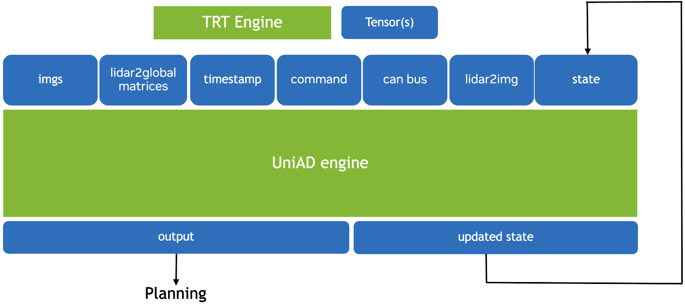

# C++ Inference Application
In this README file, we will cover the following topics:
1) Inference application environments and platforms
2) How to build the plugins and the inference application
3) How to build the engines
4) How to prepare the data for inference
5) How to run inference application

## Environments and platforms
The inference application is tested on NVIDIA DRIVE Orin platform with `TensorRT 8.6.13.3`.
## Dependencies
The inference application will use [cuOSD](https://github.com/NVIDIA-AI-IOT/Lidar_AI_Solution/tree/master/libraries/cuOSD) and [STB](https://github.com/nothings/stb) as submodules. Notice that since cuOSD do not have separate repo, we need to manually download it from the [link](https://github.com/NVIDIA-AI-IOT/Lidar_AI_Solution/tree/master/libraries/cuOSD) and put it under [dependencies folder](./dependencies/), i.e.,
```
dependencies/
|── stb/
|── cuOSD/
```
## Build TensorRT plugins and the inference application

### Plugins and C++ App Compilation
To deploy UniAD-tiny with TensorRT, we first need to compile TensorRT plugins for `MultiScaleDeformableAttnTRT`, `InverseTRT` and `RotateTRT` operators which are not supported by Native TensorRT, and then we need to build the C++ inference application. To achieve that, we will use the [CMakeLists.txt](./CMakeLists.txt) to compile the plugin library and the inference app. The source code for those plugins are from the submodule [BEVFormer_tensorrt](https://github.com/DerryHub/BEVFormer_tensorrt/tree/main).
```
mkdir ./build && cd ./build/
cmake .. -DTENSORRT_PATH=<path_to_TensorRT> && make -j$(nproc)
```

Then the ```uniad``` and ```libuniad_plugin.so``` should be generated under the ```./build``` folder


### Engine Build
To build TensorRT engine, run the following commands. Please modify FP64 binary files path for trtexec inference (`<path_to_dumped_inputs>`), TensorRT path (`<path_to_TensorRT>`), ONNX file path (`<path_to_ONNX>`), path to save TensorRT engine (`<path_to_engine>`), plugins path (`<path_to_libuniad_plugin.so>`).
```
MIN=901
OPT=901
MAX=1150
DAT_PATH=<path_to_dumped_inputs>
SHAPES="prev_track_intances0:${MIN}x512,prev_track_intances1:${MIN}x3,prev_track_intances3:${MIN},prev_track_intances4:${MIN},prev_track_intances5:${MIN},prev_track_intances6:${MIN},prev_track_intances8:${MIN},prev_track_intances9:${MIN}x10,prev_track_intances11:${MIN}x4x256,prev_track_intances12:${MIN}x4,prev_track_intances13:${MIN}"
INPUTS="max_obj_id:${DAT_PATH}/max_obj_id.dat,img_metas_can_bus:${DAT_PATH}/img_metas_can_bus.dat,img_metas_lidar2img:${DAT_PATH}/img_metas_lidar2img.dat,img:${DAT_PATH}/img.dat,use_prev_bev:${DAT_PATH}/use_prev_bev.dat,prev_bev:${DAT_PATH}/prev_bev.dat,command:${DAT_PATH}/command.dat,timestamp:${DAT_PATH}/timestamp.dat,l2g_r_mat:${DAT_PATH}/l2g_r_mat.dat,l2g_t:${DAT_PATH}/l2g_t.dat,prev_track_intances0:${DAT_PATH}/prev_track_intances0.dat,prev_track_intances1:${DAT_PATH}/prev_track_intances1.dat,prev_track_intances3:${DAT_PATH}/prev_track_intances3.dat,prev_track_intances4:${DAT_PATH}/prev_track_intances4.dat,prev_track_intances5:${DAT_PATH}/prev_track_intances5.dat,prev_track_intances6:${DAT_PATH}/prev_track_intances6.dat,prev_track_intances8:${DAT_PATH}/prev_track_intances8.dat,prev_track_intances9:${DAT_PATH}/prev_track_intances9.dat,prev_track_intances11:${DAT_PATH}/prev_track_intances11.dat,prev_track_intances12:${DAT_PATH}/prev_track_intances12.dat,prev_track_intances13:${DAT_PATH}/prev_track_intances13.dat,prev_timestamp:${DAT_PATH}/prev_timestamp.dat,prev_l2g_r_mat:${DAT_PATH}/prev_l2g_r_mat.dat,prev_l2g_t:${DAT_PATH}/prev_l2g_t.dat"
LD_LIBRARY_PATH=<path_to_TensorRT>/lib:$LD_LIBRARY_PATH \
<path_to_TensorRT>/bin/trtexec \
  --onnx=<path_to_ONNX> \
  --saveEngine=<path_to_engine> \
  --plugins=<path_to_libuniad_plugin.so> \
  --verbose \
  --dumpLayerInfo \
  --dumpProfile \
  --separateProfileRun \
  --profilingVerbosity=detailed \
  --useCudaGraph \
  --minShapes=${SHAPES//${MIN}/${MIN}} \
  --optShapes=${SHAPES//${MIN}/${OPT}} \
  --maxShapes=${SHAPES//${MIN}/${MAX}} \
  --loadInputs=${INPUTS}
```

## Test inference application
### Prepare data
The inference application will read images directly from jpg files, while it does need metadata generated in the ```Generate Preprocessed Data``` step. 

The ```Generate Preprocessed Data``` step will generate the following metadata:
timestamp    | l2g_r_mat | l2g_t | command | img_metas_can_bus | img_metas_lidar2img | img_metas_scene_token | info.txt
--------------------- | ---- | -------- | --- | --------------------------------| ------- | ---- | -------
the timestamp of the current frame | lidar2global rotation matrix | lidar2global translation | navigation command | image can bus | lidar2image matrixs | scene ids | image file paths 

Organize the data files to follow the file pattern:
```
uniad_trt_input/
|── timestamp/
|── l2g_r_mat/
|── l2g_t/
|── command/
|── img_metas_can_bus/
|── img_metas_lidar2img/
|── img_metas_scene_token/
|── info.txt
```

The ```uniad_trt_input``` folder is used as ```<input_path>```.


### Run inference
Overview of the engine inference pipeline.



Run the following command to run inference on the input data and generate output results. Notice that for the application to correctly locate and use the data, you need to call the application at the [root dir](../) of this repo.
```
cd ..
LD_LIBRARY_PATH=<path_to_TensorRT>/lib/:$LD_LIBRARY_PATH ./inference_app/build/uniad <engine_path> ./inference_app/build/libuniad_plugin.so <input_path> <output_path> <number_frame>
```
This command will read the raw images and the dumped metadata as input, run infernece using the engine and generate visualization results under the ```<output_path>``` folder.

<- Last Page: [UniAD-tiny Traning and Exportation](../documents/tiny_train_export.md)
