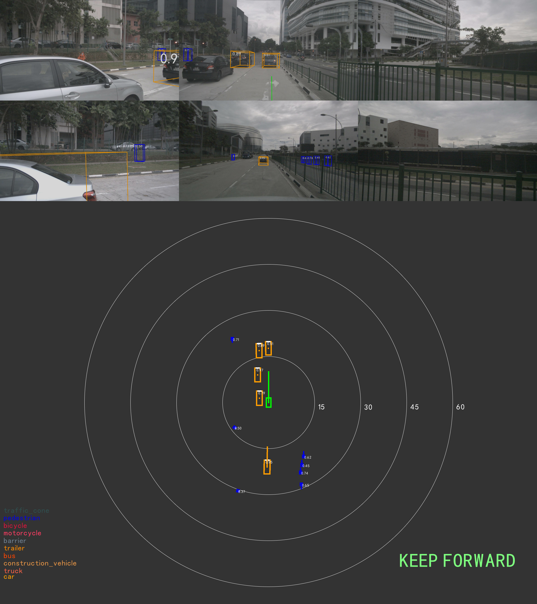

# VAD-TensorRT
VAD: Vectorized Scene Representation for Efficient Autonomous Driving([VAD](https://github.com/hustvl/VAD.git)) is an end-to-end vectorized paradigm for autonomous driving.

In this demo, we will use `VAD-Tiny` as our deployment target.

| Method   | Backbone<br>precision | Head<br>precision | Framework | avg. L2 | Latency(ms)   |
| :---:    | :---:  | :---:     | :--:      | :---:   | :---: |
| VAD-Tiny | fp16   | fp32      | TensorRT  | 0.78  | 90.2 (On Orin) |

## Environment setup

```bash
cd /workspace
git clone https://github.com/hustvl/VAD.git
git clone https://github.com/NVIDIA/DL4AGX.git
```
Please follow the instructions in the official repo ([install.md](https://github.com/hustvl/VAD/blob/main/docs/install.md), [prepare-dataset.md](https://github.com/hustvl/VAD/blob/main/docs/prepare_dataset.md)) to setup VAD environment first.
Then download `VAD_tiny.pth` from [google drive](https://drive.google.com/file/d/1KgCC_wFqPH0CQqdr6Pp2smBX5ARPaqne/view?usp=sharing) to folder `/workspace/VAD/ckpts`,

You may verify your installation with
```bash
cd /workspace/VAD
CUDA_VISIBLE_DEVICES=0 python tools/test.py /workspace/VAD/projects/configs/VAD/VAD_tiny_stage_2.py /workspace/VAD/ckpts/VAD_tiny.pth --launcher none --eval bbox --tmpdir tmp
```
This command line is expected to output the benchmark results. This environment will be referred to as `torch container`.

> **NOTE** You may need to adjust the original repo to reproduce the correct results
> 1. According to the discussion in [issue-18](https://github.com/hustvl/VAD/issues/18), you may need to change the `img_norm_cfg` in the [config](https://github.com/hustvl/VAD/blob/main/projects/configs/VAD/VAD_tiny_stage_2.py):
> ```python
> img_norm_cfg = dict(
>   mean=[103.530, 116.280, 123.675], std=[1.0, 1.0, 1.0], to_rgb=False)
> ```
> 2. If you got attribute error in /workspace/VAD/projects/mmdet3d_plugin/core/bbox/structures/lidar_box3d.py
> ```python
> # from mmdet3d.ops.roiaware_pool3d import points_in_boxes_gpu
> from mmdet3d.ops import points_in_boxes_all as points_in_boxes_gpu
> ```
> 3. For best user experience, we recommend use **torch >= 1.12**. You may also build the docker with given [./dockerfile](./dockerfile). To build the docker, here is the example command line. You may change the argument for volume mapping according to your setup.
> ```bash
> cd /workspace/DL4AGX/AV-Solutions/vad-trt
> docker build --network=host -f dockerfile . -t vad-trt
> docker run --name=vad-trt -d -it --rm --shm-size=4096m --privileged --gpus all -it --network=host \
>    -v /workspace:/workspace -v <path to nuscenes>:/data \
>    vad-trt /bin/bash
> ```

## Export to ONNX
To setup the deployment environment, you may run the following commands.
```bash
cd /workspace/DL4AGX/AV-Solutions/vad-trt/export_eval
ln -s /workspace/VAD/data data # create a soft-link to the data folder
export PYTHONPATH=.:/workspace/VAD
```
As `VAD` is a temporal model, the inference behavior is different between the first frame and the subsequent frames.
When one frame has its previous frame, it will first do a temporal warp then concat the warped feature map to the current one.
To deploy the ONNX of the first frame, you may run
```bash
python export_no_prev.py /workspace/VAD/projects/configs/VAD/VAD_tiny_stage_2.py /workspace/VAD/ckpts/VAD_tiny.pth --launcher none --eval bbox --tmpdir tmp
```
To deploy the ONNX of the subsequent frames, you may run
```bash
python export_prev.py /workspace/VAD/projects/configs/VAD/VAD_tiny_stage_2.py /workspace/VAD/ckpts/VAD_tiny.pth --launcher none --eval bbox --tmpdir tmp
```
After these two command lines, you are expected to see `vadv1.extract_img_feat`, `vadv1.pts_bbox_head.forward`, `vadv1_prev.pts_bbox_head.forward` under `/workspace/DL4AGX/AV-Solutions/vad-trt/export_eval/scratch`. Each folder contains dumped input and output tensors in binary format, and an ONNX file begin with `sim_`.

## Benchmark and Evaluation with TensorRT on x86
We provide `test_tensorrt.py` to run benchmark with TensorRT. It will produce similar result as the original benchmark with pytorch.

1. To prepare dependencies for benchmark:
```bash
pip install pycuda numpy==1.23
pip install <TensorRT Root>/python/tensorrt-<version>-cp38-none-linux_aarch64.whl
```
2. Build plugins for benchmark
```bash
export TRT_ROOT=<path to your tensorrt dir>
cd /workspace/dl4agx/AV-Solutions/vad-trt/plugins/
mkdir -p build
cmake .. 
make
```

3. Then you need to build tensorrt engine.
```bash
export LD_LIBRARY_PATH=$LD_LIBRARY_PATH:<TRT_ROOT>/lib
export PATH=$PATH:<TRT_ROOT>/bin

# build image encoder
trtexec --onnx=scratch/vadv1.extract_img_feat/sim_vadv1.extract_img_feat.onnx \
        --staticPlugins=../plugins/build/libplugins.so \
        --profilingVerbosity=detailed --dumpProfile \
        --separateProfileRun --useSpinWait --useManagedMemory \
        --fp16 \
        --saveEngine=vadv1.extract_img_feat/vadv1.extract_img_feat.fp16.engine

# build heads
trtexec --onnx=scratch/vadv1.pts_bbox_head.forward/sim_vadv1_prev.pts_bbox_head.forward.onnx \
        --staticPlugins=../plugins/build/libplugins.so \
        --profilingVerbosity=detailed --dumpProfile \
        --separateProfileRun --useSpinWait --useManagedMemory \
        --saveEngine=vadv1.pts_bbox_head.forward/vadv1.pts_bbox_head.forward.engine

# build heads with prev_bev
trtexec --onnx=scratch/vadv1_prev.pts_bbox_head.forward/sim_vadv1_prev.pts_bbox_head.forward.onnx \
        --staticPlugins=../plugins/build/libplugins.so \
        --profilingVerbosity=detailed --dumpProfile \
        --separateProfileRun --useSpinWait --useManagedMemory \
        --saveEngine=vadv1_prev.pts_bbox_head.forward/vadv1_prev.pts_bbox_head.forward.engine
```

4. Run benchmark with tensorrt
```bash
export LD_LIBRARY_PATH=$LD_LIBRARY_PATH:<TensorRT Root>/lib
python test_tensorrt.py /workspace/VAD/projects/configs/VAD/VAD_tiny_stage_2.py ckpts/VAD_tiny.pth --launcher none --eval bbox --tmpdir tmp
```
As we replace the backend from pytorch to tensorrt while keeping other parts like data loading and evaluation unchanged, you are expected to see outputs similar to the pytorch benchmark.

## Deployment on NVIDIA Drive Orin
This model is to be deployed on NVIDIA DRIVE Orin with **TensorRT 8.6.13.3**. 
We recommend using the following NVIDIA DRIVE docker image `drive-agx-orin-linux-aarch64-sdk-build-x86:6.0.10.0-0009` as the cross-compile environment, this container will be referred to as the `build container`.

To launch the docker on the host x86 machine, you may run:
```shell
docker run --gpus all -it --network=host --rm \
    -v /workspace:/workspace \
    nvcr.io/drive/driveos-sdk/drive-agx-orin-linux-aarch64-sdk-build-x86:latest
```
To gain access to the docker image and the corresponding TensorRT, please join the [DRIVE AGX SDK Developer Program](https://developer.nvidia.com/drive/agx-sdk-program). You can find more details on [NVIDIA Drive](https://developer.nvidia.com/drive) site.

### Build plugins on x86 for Drive Orin
Similar to the benchmark section, we run the following command lines inside the `build container` to build the plugin for **NVIDIA Drive Orin**.
```bash
# inside cross-compile environment
cd /workspace/dl4agx/AV-Solutions/vad-trt/plugins/
mkdir -p build+orin && cd build+orin
cmake .. -DTARGET=aarch64
make
```
If everything goes well, you will see `libplugins.so` under `vad-trt/plugins/build+orin/`

> **NOTE**
If you encountered with `No CMAKE_CUDA_COMPILER could be found.`, please run the command line below to help cmake locate `nvcc`
> ```bash
> export PATH=$PATH:/usr/local/cuda/bin
> ```

### Build demo app on x86 for Drive Orin
Similar to what we did when building plugins, you may run the following commands inside the `build container`.
```bash
# inside cross-compile environment
cd /workspace/dl4agx/AV-Solutions/vad-trt/app
bash setup_dep.sh # download dependencies (stb, cuOSD)
mkdir -p build+orin && cd build+orin
cmake -DTARGET=aarch64 .. && make
```
We expected to see `vad_app` under `vad-trt/app/build+orin/`

### Prepare for the demo run
In this demo run, we will setup everything under folder `vad-trt/app/demo`.
1. prepare plugin and app
```bash
cd /workspace/dl4agx/AV-Solutions/vad-trt/
cp plugins/build+orin/libplugins.so app/demo/
cp app/build+orin/vad_app app/demo
```
2. prepare input data and onnx files
In the `torch container` environment, run
```bash
cd /workspace/dl4agx/AV-Solutions/vad-trt/export_eval
python save_data.py /workspace/VAD/projects/configs/VAD/VAD_tiny_stage_2.py /workspace/VAD/ckpts/VAD_tiny.pth --launcher none --eval bbox --tmpdir tmp
```
This will dump necessary data files to `vad-trt/export_eval/demo_data/<numbers>/`. 
We can then move them by
```bash
cd /workspace/dl4agx/AV-Solutions/vad-trt/
cp -r export_eval/demo_data/ demo/data
cp -r export_eval/scratch/vadv1.extract_img_feat/ demo/onnx_files
cp -r export_eval/scratch/vadv1_prev.pts_bbox_head.forward/ demo/onnx_files
```

Now the `demo` folder should be organized as:
```
├── config.json
├── data/
│   ├── 1/
│   ├── 2/
│   └── ...
├── libplugins.so
├── onnx_files/
│   ├── vadv1.extract_img_feat
│   ├── vadv1_prev.pts_bbox_head.forward
│   └── vadv1.pts_bbox_head.forward
├── engines/
├── simhei.ttf
└── viz/
```

### Build engines with trtexec
You may utilize `trtexec` to build the engine from the onnx file on **NVIDIA Drive Orin**.
```bash
cd AV-Solutions/vad-trt/app/demo/
# build image encoder
trtexec --onnx=onnx_files/vadv1.extract_img_feat/sim_vadv1.extract_img_feat.onnx \
        --staticPlugins=./libplugins.so \
        --profilingVerbosity=detailed --dumpProfile \
        --separateProfileRun --useSpinWait --useManagedMemory \
        --fp16 \
        --saveEngine=engines/vadv1.extract_img_feat.fp16.engine

# build heads
trtexec --onnx=onnx_files/vadv1_prev.pts_bbox_head.forward/sim_vadv1_prev.pts_bbox_head.forward.onnx \
        --staticPlugins=./libplugins.so \
        --profilingVerbosity=detailed --dumpProfile \
        --separateProfileRun --useSpinWait --useManagedMemory \
        --saveEngine=engines/vadv1_prev.pts_bbox_head.forward.engine
```

### Run and visualize with the demo app
To run the demo app, just simply call
```bash
export LD_LIBRARY_PATH=$LD_LIBRARY_PATH:<TRT_ROOT>/lib
cd AV-Solutions/vad-trt/app/demo
./vad_app config.json
```
Then you may find visualize result under `vad-trt/app/demo/viz` in jpg format.
Similar to [uniad-trt/README.md#results](../uniad-trt/README.md#results), we only show detection and planning results.



You may find the video demo in [demo.webm](assets/demo.webm)

## License
- VAD and it's related code was licensed under [Apache-2.0](https://github.com/hustvl/VAD/blob/main/LICENSE)
- cuOSD and it's related code was licensed under [MIT](https://github.com/NVIDIA-AI-IOT/Lidar_AI_Solution/blob/master/LICENSE.md)

## Reference <a name="ref"></a>
- [VAD official Repo](https://github.com/hustvl/VAD)
- [NVIDIA TensorRT Github](https://github.com/NVIDIA/TensorRT)
- [NVIDIA Drive](https://developer.nvidia.com/drive)
- [stb](https://github.com/nothings/stb/tree/master)
- [mmdetection3d](https://github.com/open-mmlab/mmdetection3d)
- [CUDA-BEVFusion Repository](https://github.com/NVIDIA-AI-IOT/Lidar_AI_Solution/tree/master/CUDA-BEVFusion)
- [cuOSD Repository](https://github.com/NVIDIA-AI-IOT/Lidar_AI_Solution/tree/master/libraries/cuOSD)
