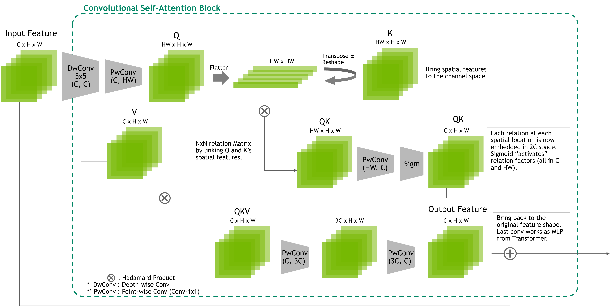

# Convolutional Self-Attention (CSA)

<!--  -->
<div align="center">
  
</div>


## ***[Emulating attention mechanism in transformer models with a fully convolutional network](https://developer.nvidia.com/blog/emulating-the-attention-mechanism-in-transformer-models-with-a-fully-convolutional-network/)***<br />
John Yang, Le An, Su Inn Park  

Unlike other convolutional models that try to ingest the attention module from transformer model, 
Convolutional Self-Attention (CSA) explicitly finds relationships among features one-to-many with only convolutions in conjunction with simple tensor shape manipulations. 
As results, CSA operates without bells and hassles in TensorRT’s restricted mode, making it suitable for AV production for safety-critical applications. 


<hr>

## Usage


We employ the same setup as that in [ConvNeXt](https://github.com/facebookresearch/ConvNeXt) repository for general usages including training/testing.
For details on environment preparation, data download, and training/evaluation scripts, please refer to the original repo for details. 

### Setting up CSA

For setting up, firstly git clone ConvNeXt repository and that of ours. 

```bash
git clone https://github.com/facebookresearch/ConvNeXt.git
git clone https://github.com/NVIDIA/DL4AGX.git
```

In order to place and set-up Conv-Self-Attention model files within the ConvNeXt implementation, the following commands set up files in the appropriate locations for the training/testing commands to be run. 

```bash
cp your/path/to/DL4AGX/ConvSelfAttention/convselfattn.py your/path/to/ConvNeXt/models
cp your/path/to/DL4AGX/ConvSelfAttention/implement_CSA.py your/path/to/ConvNeXt/
cd ConvNeXt
```

Once copying required files in the ConvNeXt repository, make sure the files in this git are located in the following directories of ConvNeXt:

```yaml
ConvNeXt
 ├ models
 │ ...
 │ └ convselfattn.py
 ├ object_detection
 ├ semantic_segmentation
 │ ...
 └ implement_CSA.py
```

Then, run the following command in order for `main.py` to include the newly implemented files:

```bash
python implement_CSA.py
```


### Training

For training the network with CSA modules, 
we established the distributed training via `bcprun` with [NVIDIA Base Command Platform](https://docs.nvidia.com/base-command-platform/user-guide/index.html).

The training was dones with 2 8-GPU nodes updating every 2 epochs to follow the original training criterion of ConvNeXt's `batch_size=4096`.

```bash
bcprun --nnodes 2 --npernode 8 --cmd 'python main.py --model convselfattn --drop_path 0.1 \
--lr 4e-3 --batch_size 128 --update_freq 2 --use_amp True --model_ema true \
--model_ema_eval false --data_path your/path/to/dataset/ \
--output_dir /results --sync_BN True --warmup_epochs 20 --epochs 300'
```

### Testing
Once the training is done, we provide an example evaluation command for a ImageNet-1K pre-trained CSA Network:

```bash
python main.py --model convselfattn --eval true --resume your/path/to/trained_model.pth
```

Our CSA network should give Top-1 accuracy of `81.30%` for FP32 inferences if trained properly with the training command above. 


<hr>


## License
The provided code can be used for research or other non-commercial purposes. For details please check the [LICENSE](LICENSE) file.
