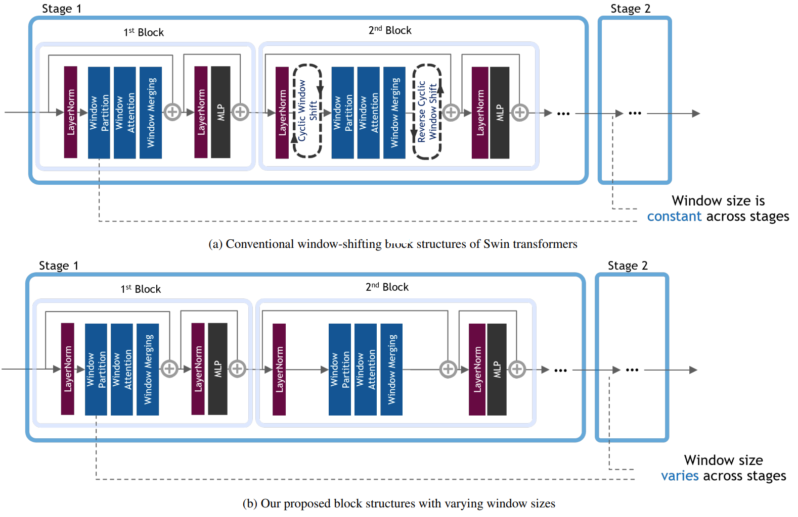

# Swin-Free Transformer

<!--  -->
<div align="center">
  
</div>

***[Swin-Free: Achieving Better Cross-Window Attention and Efficiency with Size-varying Window](https://arxiv.org/abs/2306.13776)***<br />
Jinkyu Koo, John Yang, Le An, Gwenaelle Cunha Sergio, Su Inn Park  

Swin Transformer features shifting windows that allows cross-window connection while limiting self-attention computation to non-overlapping local windows. However, shifting windows introduces memory copy operations, which account for a significant portion of its runtime. To mitigate this issue, we propose Swin-Free in which we apply size-varying windows across stages, instead of shifting windows, to achieve cross-connection among local windows. With this simple design change, Swin-Free runs faster than the Swin Transformer at inference with better accuracy. Furthermore, we also propose a few of Swin-Free variants that are faster than their Swin Transformer counterparts.


### How to patch

Swin-Free is implemented on top of the Swin Transformer repo ([Swin Transformer: Hierarchical Vision Transformer using Shifted Windows](https://github.com/microsoft/Swin-Transformer)). Please follow these steps to enable Swin-Free:

```
git clone https://github.com/NVIDIA/DL4AGX.git
cd DL4AGX/Models/SwinFree
git clone https://github.com/microsoft/Swin-Transformer.git
cd Swin-Transformer
git checkout f82860bf
git apply ../Swin-Free.patch
```

### How to train

Refer to [https://github.com/microsoft/Swin-Transformer/blob/main/get_started.md](https://github.com/microsoft/Swin-Transformer/blob/main/get_started.md) to install required python libraries. In general, Swin-Free shares the same runtime flags as the Swin Transformer. Assuming 2 GPUs on a single node, training a model can be done as the following examples:


- Swin-Free-B

```
python -m torch.distributed.launch --nproc_per_node 2 --master_port 12345 main.py --cfg configs/Swin-Free/Swin-Free_base_patch4_window7_224.yaml --data-path <imagenet-path> --batch-size 128
```


- Swin-Free-B-DR12

```
python -m torch.distributed.launch --nproc_per_node 2 --master_port 12345 main.py --cfg configs/Swin-Free/Swin-Free-DR12_base_patch4_window7_224.yaml --data-path <imagenet-path> --batch-size 128
```


- Swin-Free-S

```
python -m torch.distributed.launch --nproc_per_node 2 --master_port 12345 main.py --cfg configs/Swin-Free/Swin-Free_small_patch4_window7_224.yaml --data-path <imagenet-path> --batch-size 128
```


- Swin-Free-T

```
python -m torch.distributed.launch --nproc_per_node 2 --master_port 12345 main.py --cfg configs/Swin-Free/Swin-Free_tiny_patch4_window7_224.yaml --data-path <imagenet-path> --batch-size 128
```


- Swin-Free-B-BR

```
python -m torch.distributed.launch --nproc_per_node 2 --master_port 12345 main.py --cfg configs/Swin-Free-BR/Swin-Free-BR_base_patch4_window7_224.yaml --data-path <imagenet-path> --batch-size 128
```


- Swin-Free-B-BR-DR12

```
python -m torch.distributed.launch --nproc_per_node 2 --master_port 12345 main.py --cfg configs/Swin-Free-BR/Swin-Free-BR-DR12_base_patch4_window7_224.yaml --data-path <imagenet-path> --batch-size 128
```


- Swin-Free-S-BR

```
python -m torch.distributed.launch --nproc_per_node 2 --master_port 12345 main.py --cfg configs/Swin-Free-BR/Swin-Free-BR_small_patch4_window7_224.yaml --data-path <imagenet-path> --batch-size 128
```


- Swin-Free-T-BR

```
python -m torch.distributed.launch --nproc_per_node 2 --master_port 12345 main.py --cfg configs/Swin-Free-BR/Swin-Free-BR_tiny_patch4_window7_224.yaml --data-path <imagenet-path> --batch-size 128
```


### How to evaluate

Evaluation can be done in the same way as Swin Transformer shown in [https://github.com/microsoft/Swin-Transformer/blob/main/get_started.md](https://github.com/microsoft/Swin-Transformer/blob/main/get_started.md). That is, 

```
python -m torch.distributed.launch --nproc_per_node <num-of-gpus-to-use> --master_port 12345 main.py --eval --cfg <config-file> --resume <checkpoint> --data-path <imagenet-path>
```