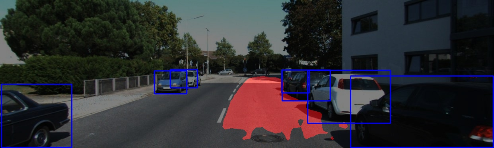

# Multi-Device Inference Pipeline

## Introduction
This is an end-to-end DriveOS application in the scope of autonomous driving on Nvidia DRIVE AGX platform. In this app, we illustrate the entire workflow from image decoding, preprocessing to inferenece and visualization using DNN engines built by TensorRT. Two DNN applications are showcased, i.e., _object detection_ and _ego-lane segmentation_.  


Currently the demo is image-based using a JPEG image as input. The TensorRT generated DNN engines are able to run concurrently on different devices, i.e., [Xavier's _integrated GPU (iGPU)_](https://developer.nvidia.com/drive/drive-agx) and [_Deep Learning Accelerators (DLA)_](http://nvdla.org/primer.html). at various precisions (i.e. for DLA - INT8 and FP16 and for iGPU FP32, FP16 and INT8). In addition, we also provide training recipes on the networks we used such that the entire workflow is reproducible. To measure the performance, profiling is implemented in the inference module.

## Sample result



## Target platform
The application is designed for NVIDIA DRIVE AGX Developer Kit running either Linux or QNX, and it can also be compiled and executed on x86_64 Linux.

## Dependencies
- CUDA: 10.1  
- CUDNN: 7.5  
- TensorRT: 5.1.1.4  
- DriveOS PDK: 5.1.3.0 or Ubuntu 16.04 on x86  
- DALI: 0.9dev (aarch64 build) 
- OpenCV: 3.4.2 (for visualization)


## How to compile
It is recommended to cross compile this program instead of natively compiling it on the Development Kit. In setting up this project you should have gone through the instructions to create a Docker image (if you have not done this refer to `//docker/README.md`) which will have the cross compiling toolchain and necessary libraries setup. 

There are two components to compile, the applications (i.e., preprocessing pipeline, engine creator, and inference pipeline) as well as the TensorRT plugin (i.e., Flatten Concatenation) for the object detector. All the applications and plugins can be compiled in one step.

_For aarch64-linux:_
```Shell
dazel build //MultiDeviceInferencePipeline/... //plugins/... --config=D5L-toolchain
```
_For aarch64-qnx_:
```Shell
dazel build //MultiDeviceInferencePipeline/... //plugins/... --config=D5Q-toolchain
```
_For x86_64-linux_:
```Shell
dazel build //MultiDeviceInferencePipeline/... //plugins/...
```

Then after making sure all dependencies are on the target and available for linking, copy the contents of `bazel-out/aarch64-fastbuild` to the target and you should be ready to run.

## Steps
### 1. Model training and conversion
We provide training recipes based on Tensorflow for the two applications in this sample: object detection and ego-lane segmentation. 

#### Object detection
The object detection model is trained on [KITTI object detection dataset](http://www.cvlibs.net/datasets/kitti/eval_object.php?obj_benchmark=2d). The object categories include car, pedestrian, and cyclist. Details on training can be found [here](training/objectDetection/README.md). 

#### Ego-Lane segmentation
The ego-lane segmentation model is trained on [KITTI road dataset](http://www.cvlibs.net/datasets/kitti/eval_road.php). Details on training can be found [here](training/laneSegmentation/README.md).

#### Convert models to UFF format
The trained models need to be converted to UFF format that is compatible with TensorRT. The python scripts for converting both models are provided along with the training recipes. 

### 2. Build preprocessing pipeline
This application demonstrates how to build a serialized DALI pipeline. The pipeline reads images in JPEG format, followed by processing steps such as resizing and normalization. The serialized pipeline is saved in binary format, and it can be loaded for other applications. We demonstrate the usage of the serialized pipeline in the application of int 8 engine creation, where where image preprocessing is required for reading calibration images. For details, please refer to [pipeline creator](pipelinecreator/README.md).

### 3. Create TensorRT engine
This step creates TensorRT optimized engines for the DNNs, the input file is the trained model in UFF format. The engine builder supports fp32 and fp16 precision as well as int8 precision by utilizing a calibration image set. The output is a serialized engine that can be used for inference. For object detector, this application also provides the option ot write the detection results in COCO standard JSON format, which can be used to calculate the performance metrics. Note that the engine has to be created on the same target where the inference is supposed to run. For details, please refer to [engine creator](enginecreator/README.md). 

### 4. Run models on DDPX
This is the inference part of the application. It loads two engines, an object detection engine and an ego-lane segmentation engie and takes a image as input. The who inference pipeline is configured via a [TOML](https://github.com/toml-lang/toml) file. In the provided configuration, inference for both engines are performed concurrently on the iGPU and DLA using DALI pipelines. Afterwards the results are postprocessed and the input image is annotated with bounding boxes and segmentation masks. 

We provide a simple profiling functionality here by reporting the _FPS_ of the concurrent execution. For details, please refer to [inference pipeline](inference/README.md).

### 5. Generate profiling report (future work)
The inference pipeline module also integrates Nvidia's [CUDA Profiling Tools Interface (CUPTI)](https://docs.nvidia.com/cuda/cupti/index.html) for profiling the inference performance. The profiling metrics include sm efficiency, flop count and DRAM utilization. 

